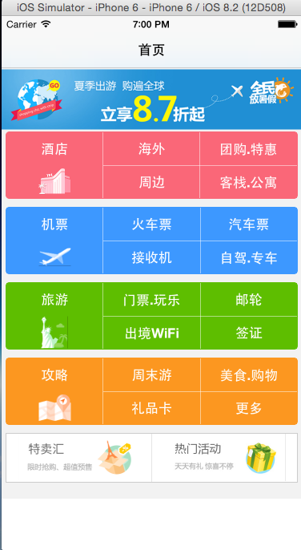
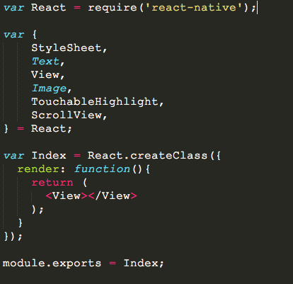

#React-Native入门指南
##第四篇React-Native布局实战(二)
	在不断深入的过程中，发现React-Native布局和样式的坑还有很多，他没有像浏览器那样灵活和有规律可循，其中的规律需要我自己踩坑的时候发现。比如：不存在zIndex,后面的元素覆盖前面的元素；内层元素覆盖外层元素等等,borderRadius的设置，需要考虑到内层元素的位置等等。

###一、实战的内容
	这里选用携程的App首页作为栗子，随不是严格的9宫格(比9宫格稍微难点...)，但是可以很好的让我们练习flexbox.最后需要完成的结果如下：

###二、分解内容
	整个页面我们可以分为几个部分，大致如下：
+ 头部
+ 图片轮播
+ 9宫格
+ 底部活动

###三、头部导航栏
	因为，组件还没有讲，这里只是做一个简单的介绍。在React-Native中实现头部导航栏很简单，只要使用NavigatorIOS组件即可。现在开工。
	
	1、我们在index.ios.js中添加如下代码；同时创建文件夹pagaes和pages下创建Index.js
	var React = require('react-native');
	var Index = require('./pages/Index');

	var {
    	NavigatorIOS,
	  	AppRegistry,
    	StyleSheet,
	} = React;

	var NV = React.createClass({
    	render: function(){
      		return(
         		<NavigatorIOS
            		style={styles.container}
            		initialRoute={{
              			title: '首页',
              			component: Index,
            		}}
            	/>
      		);
      	}
	});

	var styles = StyleSheet.create({
		container: {
    		flex: 1,
    	}
	});

	AppRegistry.registerComponent('HelloWorld', () => NV);
	
	分析代码：
	 （1）require：引入外部模块，就像，引入我们自己创建的/pages/Index.js一样。
	 （2）引入定义NavigatorIOS、AppRegistry、StyleSheet组件和类。
	 （3）在render中调用NavigatorIOS组件，initialRoute是初始化路由，title是当前页面的头部标题；component是当前路由下显示的组件；
	 （4）注意：这里NavigatorIOS的style需要设置大小，比如这里设置是flex：1，否则就不能显示内容主体；
	 （5）最后我们需要注册当前应用：AppRegistry.registerComponent('HelloWorld', () => NV);
	 
	 2、创建Index.js文件，文件的内容如下, module.exports就暴露了Index模块。

	 效果如下图：

###四、图片轮播
	这里图片轮播使用的是第三方组件react-native-swiper,当然React-Native是支持transform可以直接实现一套。我们启动npm命令行，在项目的根目录使用如下命令安装模块。
	
	$ npm install react-native-swiper --save
	$ npm i react-timer-mixin --save

(2)需要关闭React packager命令行和模拟器，在xcode中重启项目
	
	安装完成后，我们需要完成轮播功能。因为可以到github看看swiper暴露的接口和参数。github地址是：https://github.com/leecade/react-native-swiper
	
	（1）引入swiper,前面也提到了require.
	var Swiper = require('react-native-swiper');
	
	（2）使用swiper,将轮播图封装成单独的组件
	var sliderImgs = [
		'http://images3.c-ctrip.com/SBU/apph5/201505/16/app_home_ad16_640_128.png',
		'http://images3.c-ctrip.com/rk/apph5/C1/201505/app_home_ad49_640_128.png',
		'http://images3.c-ctrip.com/rk/apph5/D1/201506/app_home_ad05_640_128.jpg'
	];
	var Slider = React.createClass({
		render: function(){
	    return (
	      <Swiper style={styles.wrapper} showsButtons={false} autoplay={true} height={150} showsPagination={false}>
	        <Image style={[styles.slide,]} source={{uri: sliderImgs[0]}}></Image>
	        <Image style={[styles.slide,]} source={{uri: sliderImgs[1]}}></Image>
	        <Image style={[styles.slide,]} source={{uri: sliderImgs[2]}}></Image>
	      </Swiper>
	    );
	  }
	});
	(3)这样我们可以直接在render的时候直接用：<Slider/>
	
###五、完成第一个9宫格布局，后面复制拷贝
	其实4个九宫格都是一样，这个其实可以封装成组件，这里采用拷贝的形式，开发一个，其他3个就ok的，不会偷懒的工程师，不是好工程师［偷笑］。分析下布局：
	（1）其实首先是3个列在一行的布局，那么外层组件是需要flexDirection: 'row'，各占据宽度的1/3,即各自flex:1；
	（2）每个列内又分两行， 需要每个行都是flex:1,各占据高度的一半；
	（3）第一列是文字图片组合，其余都是文字组合；
	（4）所有行内元素都是水平、垂直居中；
	（5）这里使用了个TouchableHighlight组件，是为了出发onPress事件，类似于click或者touch事件。
	
	        <View style={[styles.sbu_red, styles.sbu_view]}>
        	<TouchableHighlight underlayColor={'#FA6778'} style={{flex:1}}>
	        	<View style={[styles.sbu_flex, styles.sbu_borderRight]}>
	        		<View style={[styles.sub_con_flex, styles.sub_text]}>
	        			<Text style={[styles.font16]}>酒店</Text>
	        		</View>
	        		<View style={[styles.sub_con_flex]}>
	        			<Image style={[styles.sbu_icon_img]} source={{uri:BUIcon[0]}}></Image>
	        		</View>
	        	</View>
	        </TouchableHighlight>
        	<View style={[styles.sbu_flex, styles.sbu_borderRight]}>
        		<View style={[styles.sub_con_flex, styles.sub_text, styles.sbu_borderBottom]}>
        			<Text style={[styles.font16]}>海外</Text>
        		</View>
        		<View style={[styles.sub_con_flex, styles.sub_text]}>
        			<Text style={[styles.font16]}>周边</Text>
        		</View>
        	</View>
        	<View style={[styles.sbu_flex]}>
        		<View style={[styles.sub_con_flex, styles.sub_text, styles.sbu_borderBottom]}>
        			<Text style={[styles.font16]}>团购.特惠</Text>
        		</View>
        		<View style={[styles.sub_con_flex, styles.sub_text]}>
        			<Text style={[styles.font16]}>客栈.公寓</Text>
        		</View>
        	</View>
        </View>	
###六、样式类
	说完了布局的原理，这里需要贴上样式仅供参考：
	var styles = StyleSheet.create({
	//container
  	container:{
    	backgroundColor:'#F2F2F2',
    	flex:1,
  	},
  	//slider
  	wrapper: {
    	height:80,
  	},
  	slide: {
    	height:80,
    	resizeMode: Image.resizeMode.contain,
  	},
  	//sbu
  	sbu_view:{
  		height:84,
  		marginLeft: 5,
  		marginRight:5,
  		borderWidth:1,
  		borderRadius:5,
  		marginBottom:10,
  		flexDirection:'row',
  	},
  	sbu_red:{
  		backgroundColor: '#FA6778',
  		borderColor:'#FA6778',
  		marginTop:-70,
  	},

  	sbu_blue:{
  		backgroundColor: '#3D98FF',
  		borderColor:'#3D98FF',
  	},

  	sbu_green:{
  		backgroundColor: '#5EBE00',
  		borderColor:'#5EBE00',
  	},

  	sbu_yellow:{
  		backgroundColor: '#FC9720',
  		borderColor:'#FC9720',
  	},
  	sbu_flex:{
  		flex:1,
  	},
  	sbu_borderRight:{
  		borderColor:'#fff',
  		borderRightWidth: 0.5,
  	},
  	sbu_icon_img:{
  		height:40,
  		width:40,
  		resizeMode:Image.resizeMode.contain,
  	},
  	sub_con_flex:{
  		flex:1,
  		justifyContent: 'center',
  		alignItems: 'center',
  	},
  	sub_text:{
  		justifyContent:'center',
  	},
  	font16:{
  		fontSize:17,
  		color:'#FFF',
  		fontWeight:'900',
  	},
  	sbu_borderBottom:{
  		borderBottomWidth:0.5,
  		borderBottomColor:'#fff',
  	},
  	img_view:{
  		height:62,
  		marginLeft:5,
  		marginRight:5,
  		flexDirection: 'row',
      	marginBottom:20,
      	backgroundColor:'#fff',
  	},
  	img_flex:{
  		flex:1,
  		borderWidth:1,
  		borderColor:'#ccc',
  	},
  	img_wh: {
  		height:59,
      	borderRightWidth:0,
  		resizeMode:Image.resizeMode.contain,
  	}
	});
	
	着重说下resizeMode:Image.resizeMode.contain。在React-Native中图片的大小是不会根据给定一个宽度或者高度而自适应大小的，因此我们需要让图片根据宽度或者高度来自适应，那么可以使用resizeMode:Image.resizeMode.contain。facebook提示错误信息的样式表中也没有提及，文档中也没有提及。所以后续还有不少的坑需要大家去一起探索。

###七、Index.js整个代码，仅供参考

	实例代码中会涉及ScrollView组件，主要是为了适应小屏的机器，可以滚动视图。
[代码链接：github](https://github.com/vczero/react-native-lession/tree/master/code/%E7%AC%AC4%E7%AF%87%E5%B8%83%E5%B1%80%E5%AE%9E%E6%88%98%EF%BC%88%E4%BA%8C%EF%BC%89%E4%BB%A3%E7%A0%81)
	
	
	
	
	
	
	
	
	
	
	